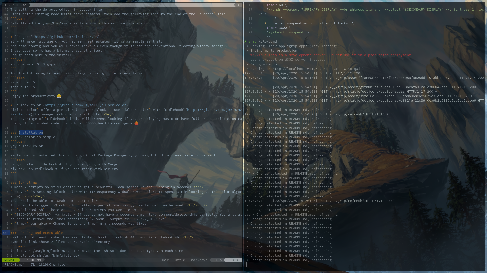
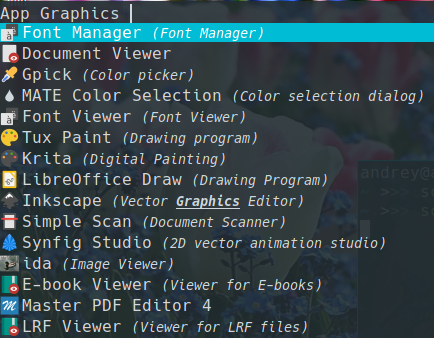
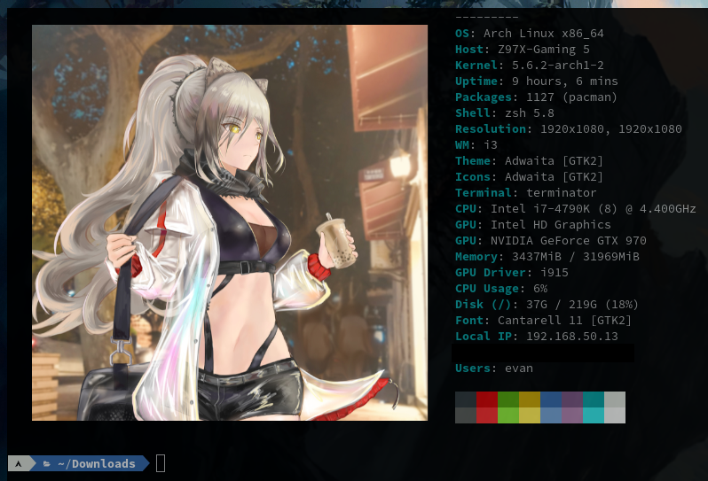
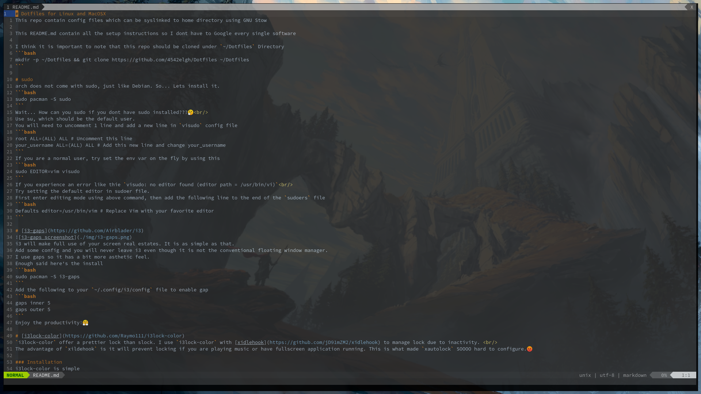
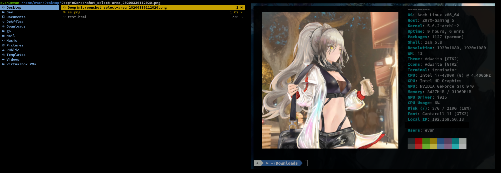
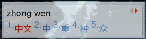
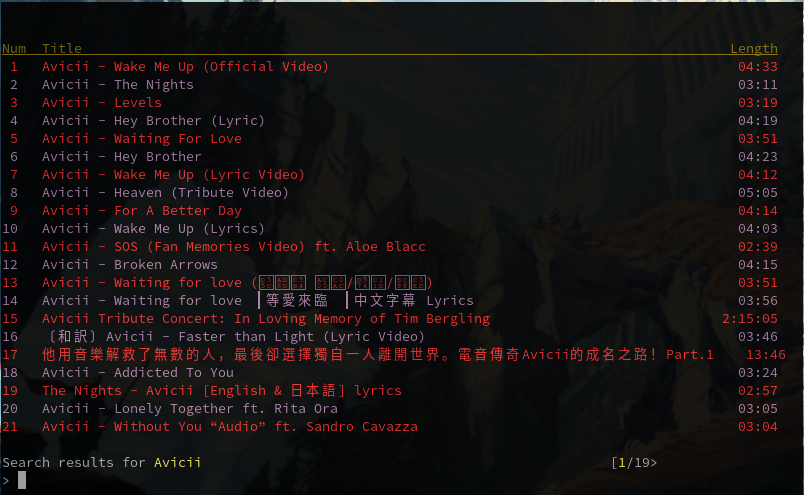
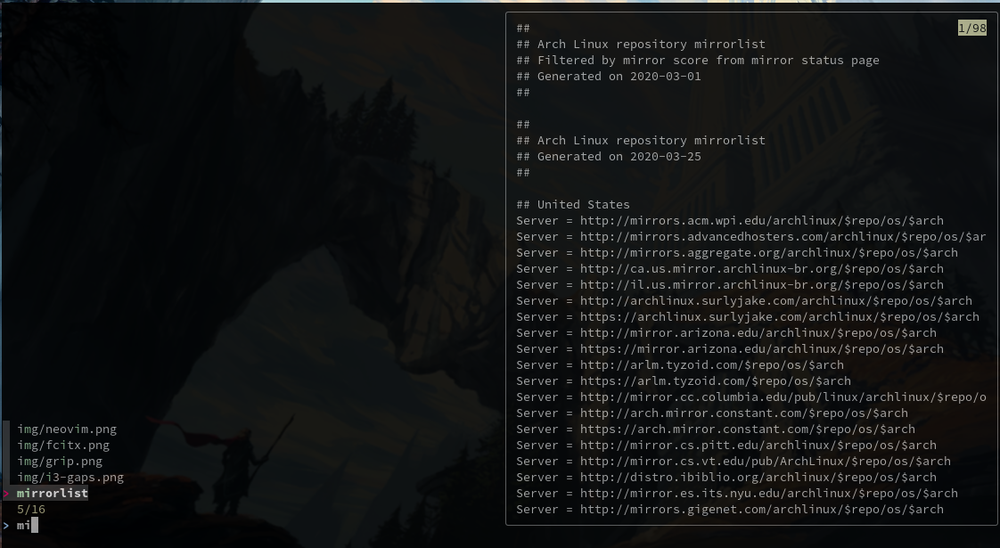

# Dotfiles for Linux and MacOSX
This repo contain config files which can be syslinked to home directory using GNU Stow

This README.md contain all the setup instructions so I dont have to Google every single software

I think it is important to note that this repo should be cloned under `~/Dotfiles` Directory
```bash
mkdir -p ~/Dotfiles && git clone https://github.com/4542elgh/Dotfiles ~/Dotfiles
```

# sudo
arch does not come with sudo, just like Debian. So... Lets install it.
```bash
sudo pacman -S sudo
```
Wait... How can you sudo if you dont have sudo installed???🤔<br/>
Use su, which should be the default user.
You will need to uncomment 1 line and add a new line in `visudo` config file
```bash
root ALL=(ALL) ALL # Uncomment this line
your_username ALL=(ALL) ALL # Add this new line and change your_username
```
If you are a normal user, try set the env var on the fly by using this
```bash
sudo EDITOR=vim visudo
```
If you experience an error like thie `visudo: no editor found (editor path = /usr/bin/vi)`<br/>
Try setting the default editor in sudoer file.
First enter editing mode using above command, then add the following line to the end of the `sudoers` file
```bash
Defaults editor=/usr/bin/vim # Replace Vim with your favorite editor
```

# [i3-gaps](https://github.com/Airblader/i3)

i3 will make full use of your screen real estates. It is as simple as that.
Add some config and you will never leave i3 even though it is not the conventional floating window manager.
I use gaps so it has a bit more asthetic feel.
Enough said here's the install
```bash
sudo pacman -S i3-gaps
```
Add the following to your `~/.config/i3/config` file to enable gap
```bash
gaps inner 5
gaps outer 5
```
Enjoy the productivity!🤗

# [i3lock-color](https://github.com/Raymo111/i3lock-color)
`i3lock-color` offer a prettier lock than slock. I use `i3lock-color` with [xidlehook](https://github.com/jD91mZM2/xidlehook) to manage lock due to inactivity. <br/>
The advantage of `xildehook` is it will prevent locking if you are playing music or have fullscreen application running. This is what made `xautolock` SOOOO hard to configure.😡

### Installation
i3lock-color is simple
```bash
yay i3lock-color
```
xidlehook is installed through cargo (Rust Package Manager), you might find `nix-env` more convenient.
```bash
cargo install xidelhook # If you are going with Cargo
nix-env -iA xidlehook # If you are going with nix-env
```

### Scripting
I made 2 scripts so it is easier to get a beauitful lock screen up and running in seconds.<br/>
`Lock.sh` is setting i3lock-color with (transparency & dual kawase blur) (I spent 3 min looking up this blur algorithm). <br/><br/>
You should be able to tweak some text color
In order to trigger `i3lock-color` after a period inactivity, `xidlehook` can be used. <br/><br/>
In `xidlehook.sh`, there are several parameters you want to tweak.
* `SECONDARY_DISPLAY` variable - If you do not have a secondary monitor, comment/delete this variable. You will also need to remove the lines containing `xrandr --output "$SECONDARY_DISPLAY"`
* `timer` variable - Change it to the time in miliseconds you like.

### Linking and executable
Last but not least, make them executable `chmod +x lock.sh && chmod +x xidlehook.sh` <br/>
Symbolic link those 2 files to /usr/bin directory.
```bash
ln lock.sh /usr/bin/lock #Note I removed the .sh so I dont need to type .sh each time
ln xidlehook.sh /usr/bin/xidlehook
```
Now it is simple as putting it to your i3 config file.
```bash
exec --no-startup-id xidlehook
```
Lock screen just look so clean.🤭

# [Terminator](https://gnometerminator.blogspot.com/p/introduction.html)
I use Terminator as my terminal emulator. I give up on configuring uRXVT, because its hard if not possible, to configure Powerlevel10k on it. Terminator Powerlevel10K out of the box, and my config file is 3 lines. 

```bash
sudo pacman -S terminator
```

# MIME
`MIME` is a way to tell what `.desktop` application to use to open a spcific link/file/etc.<br/>
Terminal use MIME to determine what browser to open the links.<br/>
It probably defaults to firefox, but if you want another program to open you links, you can do the following.
```bash
xdg-mime default chromium.desktop x-scheme-handler/http
xdg-mime default chromium.desktop x-scheme-handler/https 
```

# Sound/ALSA/PulseAudio
First we need to add a few libraries
```
pacman -S pulseaudio pulseaudio-alsa alsa-firmware alsa-utils
```
Then try turning on volume in `pavucontrol`
If that does not work then get your device id by typing
```
aplay -l
```
Remember your device id and put it in .asoundrc (Sample file in Dotfile folder) and `stow` it.
Then open `alsamixer` and select your device, PCH can be one of them. Then unmute them by pressing M
If that doesnt work, try Arch Wiki

For volume control get your device string by this command
```bash
pacmd list-sources | grep -e 'index:' -e device.string -e 'name:'
```
open i3 config and change the @MOD+up and @MOD+down with
```bash
pactl -- set-sink-volume <YOUR_DEVICE_STRING> +5%
```

# [Compton/Picom](https://github.com/yshui/picom)
Transparency is purely for asthetic, but it makes your Windows Manager so much more appealing! I only made my terminal have transparency, but feel free to make it however you like.
```bash
sudo pacman -S picom
```
Grab my picom config folder and stow it into your home directory. Be sure to change Terminator to your terminal application name.
```bash
stow picom
```
Put this line in your i3 config.
```bash
exec --no-startup-id picom -b
```

# [GlassCord - Dual Kawase Blur Discord](https://github.com/AryToNeX/Glasscord)
<br/>
Install Discord first.
```bash
yay discord
```
Next, you will need to install one of the three custom CSS Loader<br/>
* [BandagedBD](https://github.com/rauenzi/BetterDiscordApp)
* [BeautifulDiscord](https://github.com/leovoel/BeautifulDiscord)
* [EnhancedDiscord](https://github.com/joe27g/EnhancedDiscord)

I use BandagedBD, so the steps to inject BandagedBD would be as follow.
They have a CTL tool to help you install, simply execute the lines one by one
```bash
curl -O https://raw.githubusercontent.com/bb010g/betterdiscordctl/master/betterdiscordctl
chmod +x betterdiscordctl
sudo mv betterdiscordctl /usr/local/bin
```
It is always a good idea to update to latest stable build by `sudo betterdiscordctl upgrade`<br/>
Then install Bandaged BetterDiscord by typing `betterdiscordctl install`
If everything goes well, you can start discord and a new prompt popup showing new features of BandagedBD.
You can confirm you have BandagedBD by going to settings and a new set of options should appear at the very bottom.<br/>
<br/>
Go to GlassCord repo's release tab and download the latest glasscord.asar

Then place it under `~/.config/discord/VERSION_NUMBER/modules/discord_desktop_core/`
In the same directory edit the `index.js` file. Add a new line at the very top of the file
```javascript
require('./glasscord.asar');
```

Last but not least make sure xprop is installed.
```bash
sudo pacman -S xorg-xprop
```

Restart Discord and you should have a Dual Kawase Blur Discord. 😏

# [Stow](https://www.gnu.org/software/stow/)
I think it is important to note that this repo should be cloned under `~/Dotfiles` Directory
```bash
mkdir -p ~/Dotfiles && git clone https://github.com/4542elgh/Dotfiles ~/Dotfiles
```

It is much easier to manage your dotfiles with Stow. Dotfiles contain all your config folder in one directory and with a simple `stow zsh` given that zsh is a folder, stow will symoblic link that ***folder's content*** into `stow zsh` execution directory's parent.<br/>
Given the following structure in `/home/evan`
```
evan
|_Dotfiles
  |_zsh
    |_.zshrc
    |_.zsh_alias
```
If I `stow zsh` inside Dotfiles folder. it will take the content of zsh folder, and place it 1 folder above Dotfiles. Which is my home directory. This way I applied my latest `.zshrc` and `.zsh_alias` with a simple command rather copy and paste from repo's file.

Whatever changes I made in the symlink will be referring back to the `Dotfiles/zsh` file as well. So your file in `Dotfiles` are always the source of truth.
```bash
sudo pacman -S stow
```

# ZSH
I am sure you heard all the good things about ZSH. It support Powerlevel10K which I believe is the best prompt out there. It also support a variety of plugins (you can grab some [Oh My ZSH!](https://github.com/ohmyzsh/ohmyzsh/) plugins without installing the entire framework). 
ZSH folder have some sane config I use everyday
```bash
sudo pacman -S zsh
```
Set current user to use zsh shell
```bash
chsh -s /bin/zsh ${USER}
```
Use stow to syslink entire zsh folder to your home dir, or create your own .zshrc config
```bash
stow zsh
```

# [Antibody](https://github.com/getantibody/antibody)
There are more than a dozen ZSH plugin manager to choose from. However, I find Antibody offer the best speed. It loads plugins statically, saving time on first boot.
Install Antibody is easy:
```bash
curl -sfL git.io/antibody | sh -s - -b /usr/local/bin
```
I already implement all the speed up suggest in their website into `.zshrc` which did improve boot up speed quite a lot.
After you done adding plugins to `zsh_plugins.txt` (re)generate the plugins is easy
```bash
antibody bundle < ~/.zsh_plugins.txt > ~/.zsh_plugins.sh
```
Then it is as easy as `source ~/.zsh_plugins.sh` to get all the plugins running.

# [Clipster](https://github.com/mrichar1/clipster) & [Rofi](https://github.com/davatorium/rofi) & [Rofi-Clips](https://github.com/gilbertw1/roficlip)
<br/>
I was initially searching for a clipboard manager, and I came across clipster, and it is recommended to use with Rofi-Clips add-on for better experience. Then I realize Rofi framework itself is more intuitive to use than dmenu (i3wm default menu selection)
```bash
sudo pacman -S rofi
yay clipster
```
You will need to start clipster daemon, for now you can use the `-d` flag.
For it to auto start on reboot, it is recommended to put clipster daemon in your wm startup config file or in systemd service.
In my i3 config file, I have `exec --no-startup-id clipster -d --config="PATH_TO_YOUR_CONFIG_FILE"` at the bottom
For debugging purpose, manually starting clipster with
```bash
clipster -d
```
Note I did not install roficlip from AUR, because I made a small tweak for roficlip to display both PRIMARY (Mouse selection) and CLIPBOARD (Ctrl+C selection)
You will need to grab the file from github and put it inside /bin folder
Make sure you have the following dependencies
*wget
*gawk
*fzf
*clipster (You should already installed and enabled the service at this point)
```bash
wget https://github.com/4542elgh/roficlip/blob/master/roficlip # Download file from github
chmod +x roficlip # Set execute permission
sudo mv roficlip /usr/bin # This step can be avoid if you set PATH to contain the folder containing roficlip
```
Rofi out of the box act as a search engine for applications (again, its a replacement for dmenu)
Roficlip which I alias to clip, will take all copied items and store in a plain text file. (See Github for it's location)
Press Ctrl+J/K to move up and down, ENTER to copy the highlighted item into PRIMARY & CLIPBOARD selection.

# Image Capture (ImageMagick + xclip)
On the topic of clipboard, capturing monitor image to clipboard or save as file is really useful.
No additional software needed, ImageMagick will take screen capture and save to your home directory. 
To capture image into clipboard, there is xclip to do it.
Those 2 functionalities are mapped to i3 keybinding.
Copy to clipboard
$Mod + A
```bash
bindsym $mod+a --release exec import png:- | xclip -selection clipboard -t image/png
```
Save Image to Directory
$Mod + Shift + A
```bash
bindsym $mod+shift+a --release exec cd $HOME/Pictures && import $(date +'%m%d%Y%H%M%S').png
```
Change the cd to the path where you want to save your screenshot capture.

# [yay](https://github.com/Jguer/yay)
But seriously, yay is what I use to manage AUR (Arch User Repository)<br/>
If you want to compile your own PKGBUILD
You can Google the AUR of your package
Git clone the repo into a directory, then do makepkg -sicr in that folder.
Note that without yay, you lose the ability to auto update AUR packages to latest release
**MAKE SURE TO RTFM BEFORE UPDATING ALL YOUR SYSTEM SOFTWARE, KERNEL, ETC.**

```bash
git clone https://aur.archlinux.org/yay.git ~/Downloads
cd ~/Downloads/yay
makepkg -sicr
```

# [bumblebee-status](https://github.com/tobi-wan-kenobi/bumblebee-status)
Trust me, I have tried SO hard to get powerline running on my bar. Bumblebee is the one work out of the box, and easily configurable (Python)
```bash
yay bumblebee-status
```
I used the `iceberg-rainbow` theme, while remove the gray background color b/c its hard to see.
Bumblebee status is defined in i3 config file under `bar` attribute.

# Fonts
I personally use 4 fonts
[DejaVu](https://github.com/ryanoasis/nerd-fonts/tree/master/patched-fonts/DejaVuSansMono) part of the [Nerdfont](https://www.nerdfonts.com) family - Nerdfonts have glyph for COOLER CLI.<br/>
BUT IT DOES NOT MAKE YOU A 10X DEVELOPER
```bash
yay nerd-fonts-dejavu-complete
```
[tff-joypixels](https://www.joypixels.com/download) for emojis
```bash
yay ttf-joypixels
```
Chinese support: [adobe-source-han-sans-cn-fonts](https://fonts.adobe.com/fonts/source-han-sans-simplified-chinese) and [adobe-source-han-sans-tw-fonts](https://fonts.adobe.com/fonts/source-han-sans-traditional-chinese)
CN is for Simplified Chinese, and TW is for Traditional Chinese
```bash
sudo pacman -S adobe-source-han-sans-cn-fonts adobe-source-han-sans-tw-fonts
```
To make sure you are inputing the correct name for your config file, do the following to check:
```bash
fc-list | grep "your font name"
```
and the name after your font's name is the name you want to put in config file, for DejaVuSansMono.ttf, I should input `DejaVu Sans Mono` as my font name.

# [Neofetch](https://github.com/dylanaraps/neofetch)
<br/>
Get that wholesome Arch Logo and Sys Info in your terminal. Dont know what am talking about? Take a look at [/r/UnixPorn](https://www.reddit.com/r/unixporn/)

Installing is simple
```bash
sudo pacman -S neofetch
```
If you want to display image, make sure you have `w3m` installed and `stow` neofetch files into `~/.config` directory

# [Neovim](https://github.com/neovim/neovim)
<br/>
Everyone will have their own sets of .vimrc/.init.vim, I do have a list of plugins that I think is convenient to have. Maybe you will find something you need but didnt know exist. 🤔 
```bash
sudo pacman -S nvim
```
# [vim-plug](https://github.com/junegunn/vim-plug) 
I use vim-plug to manage vim plugins, install that would be really helpful. If not you will not be able to install any vim plugins
```bash
curl -fLo ~/.local/share/nvim/site/autoload/plug.vim --create-dirs \
	https://raw.githubusercontent.com/junegunn/vim-plug/master/plug.vim
```

# [Ranger](https://github.com/ranger/ranger)
<br/>
It suppose to be a file explorer. However, I mainly use it for image/pdf preview. With some help from `w3m` it is a fast and simple explorer to use.
```bash
sudo pacman -S ranger
```
[Image Preview Integration](https://github.com/ranger/ranger/wiki/Image-Previews)
You will need to install `ueberzug`
```bash
pip3 install ueberzug
```
Or you can just `stow` my dotfile, which will do the same thing. (You will still need to install ueberzug)
```bash
stow ranger
```
PDF preview is done using `Zathura` and plugin `zathura-pdf-poppler`
```bash
sudo pacman -S zathura zathura-pdf-poppler
```
Then edit `scope.sh`
find `handle_image()` and uncomment `application/pdf` entry
You should able to preview PDF at this point.😃

# [Grip](https://github.com/joeyespo/grip)
<br/>
I write this markdown with Vim and previewed in Grip, a Github preview server written in Python3.
It is as simple as `grip README.md` and a localhost will serve your markdown file rendered same way as Github does.
Install is easy
```bash
pip3 install grip
```

# [Fcitx](https://github.com/fcitx/fcitx5)
 Input prompt is not transparent, screenshot made its shot half way during fcitx disappearing<br/>
If you are using Chinese input method, then [fcitx](https://fcitx-im.org/wiki/Fcitx) framework will be a good option
Additionally, you will need to install **one** of the chinese input methods, the one I use is **fcitx-sunpinyin**
You can find a full list of input methods from the [Official Arch Wiki](https://wiki.archlinux.org/index.php/fcitx)
```bash
sudo pacman -S fcitx fcitx-sunpinyin
```
You can switch to fcitx by pressing `Ctrl-[Space]`

# [Enable number lock](https://wiki.archlinux.org/index.php/Activating_numlock_on_bootup)
By default, tty terminal does not enable number lock. You will need to install a package for tty to turn on number lock at login.
```bash
sudo pacman -S numlockx
```
and in your .xinitrc, add an entry before `exec i3`
```bash
numlockx &
```

Remember that & just means to run this in background, dont block current process.

# Removable Devices auto-mount
I use udisk2 along with Udiskie to achieve mounting on login. Unfortunately Udiskie does not support mounting to custom path. I just create an alias to /run/media/$USER. 
Install is simple as always
```bash
sudo pacman -S udisk2 udiskie
```
Then run `udiskie` will get your removable devices mounted. Nice and simple. 💪

# Bluetooth
## Dependencies
Bluez - Provide Bluetooth protocol interface
Bluez-utils - Provide bluetoothctl for CLI interface
pulseaudio-alsa - ALSA is a frontend interface for pulseaudio server
pulseaudio-bluetooth - Interact with bluetooth device
```bash
sudo pacman -S bluez bluez-utils pulseaudio-alsa pulseaudio-bluetooth
```
Enable bluetooth service
```bash
sudo systemctl enable bluetooth # Start this service on boot
sudo systemctl start bluetooth # Start service manually now
```

## Pairing
Enter bluetooth CLI
```bash
bluetoothctl
```
Power on the module and agent, then start scanning
```bash
[bluetooth]# power on
[bluetooth]# agent on
[bluetooth]# default-agent
[bluetooth]# scan on
```
Turn on your bluetooth device and put it in pairing mode
You should see a [NEW] device with its mac address
Eg:
```bash
[NEW] Device 00:1D:43:6D:03:26 Lasmex LBT10
```
Now it is as simple as pair, connect, and trust, then we can close the CTL
```bash
[bluetooth]# pair 00:1D:43:6D:03:26
[bluetooth]# connect 00:1D:43:6D:03:26
[bluetooth]# trust 00:1D:43:6D:03:26 # (Optional) If you want to automatically connect to this device in the future
[bluetooth]# scan off # Stop the scan
[bluetooth]# exit
```

## Auto connect
**If you have not trusted your bluetooth device, you need to do it right now (see Pairing step)**

For Pulse Audio to redirect audio output to bluetooth device
Add the following to /etc/pulse/default.pa
```bash
# automatically switch to newly-connected devices
load-module module-switch-on-connect
```
Enable bluetooth auto power on by appending the following line in `/etc/bluetooth/main.conf`
```bash
[Policy]
AutoEnable=true
```
Enjoy! 🤣

# [mps-Youtube](https://github.com/mps-youtube/mps-youtube)
<br/>
I ususally code with some music on. So here it is, a CLI util just for listening to Youtube music.
You do need to have python3 installed.
```bash
pip3 install --user mpsyt
```
You will also need to obtain your own Google Youtube API Key. (Do a Google Search for that)
Then set your new API key after you launch mpsyt
```bash
set api_key <YOUR_API_KEY>
```
MPlayer is the music player MPS-Youtube uses, be sure to install that
```bash
sudo pacman -S mplayer
```
Set your new music player
```bash
set player mplayer
```

# File search
There are times I want to do a quick lookup of a file. Either by filename or file content
I use [fzf](https://github.com/junegunn/fzf), [mlocate](https://pagure.io/mlocate) (lookup through filename), and [ag (the silver searcher)](https://github.com/ggreer/the_silver_searcher) (lookup through file content)
<br/>
FZF is async, fuzzy, interactive search engine that also provide file preview.
```bash
sudo pacman -S fzf
```
mlocate is just searching through a predetermine db tree and return you the result.
```bash
sudo pacman -S mlocate
```
mlocate require you to populate the database before doing any searches. It is also recommended to repopulate your database once a while to have most up to date tree.
```bash
sudo updatedb # This will update the database search tree
```
ag - The silver searcher - is a super fast content searcher 
```bash
sudo pacman -S ag
```

# Programming Languages
# [NPM](https://nodejs.org/en/)

## Global NPM without Sudo
Global NPM packages should not use sudo command. (Use NPM in user's own home directory)

Make npm-package directory to store global modules
```bash
mkdir "${HOME}/.npm-packages"
```
Configure npm to use the above path for global package
```bash
npm config set prefix "${HOME}/.npm-packages"
```
Put the following command in your `.bashrc/.zshrc`
```bash
# Define a variable for Global NPM Package
NPM_PACKAGES="${HOME}/.npm-packages"

# Append to the current PATH variable
export PATH="$PATH:$NPM_PACKAGES/bin"

# Preserve MANPATH if you already defined it somewhere in your config.
# Otherwise, fall back to `manpath` so we can inherit from `/etc/manpath`.
export MANPATH="${MANPATH-$(manpath)}:$NPM_PACKAGES/share/man"
```

# Make CAPS_LOCK Great Again!
I use [karabinar](https://karabiner-elements.pqrs.org/) for MacOSX to map Caps_Lock to both Ctrl[Hold] and Esc[Press].<br/>
For Linux, it is a bit more work. After some investigation, I think this is what I am happy with.
You will need [interception-caps2esc-no-caps-git](https://aur.archlinux.org/packages/interception-caps2esc-nocaps-git/) note this version is different to the original interception-caps2esc as the original one break vim in some circumstances(like this README.md).
```bash
yay interception-caps2esc-nocaps-git
```
Make a file named `udevmon.yaml` in /etc folder
```yaml
- JOB: "intercept -g $DEVNODE | caps2esc | uinput -d $DEVNODE"
  DEVICE:
    EVENTS:
      EV_KEY: [KEY_CAPSLOCK, KEY_ESC]
```
Start the service with
```bash
sudo systemctl start udevmon
```
TEST THE SERVICE FIRST BEFORE ENABLE IT ON BOOT.<br/>
Otherwise if it does not work, you will need to use your rescue USB to remove the service since the service autostart.<br/>
If you feel its good to go 
```bash
sudo systemctl enable udevmon
```
At this point you should have ESC mapped to Caps_Lock.
